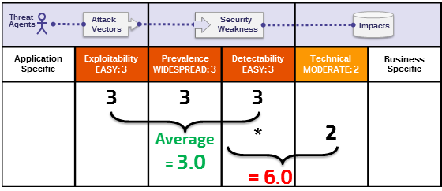

# +R Lưu ý về Rủi ro

## Đó là về các rủi ro mà Điểm yếu đại diện

Phương pháp Đánh giá Rủi ro cho Top 10 dựa trên cơ sở của [Phương pháp đánh giá rủi ro OWASP](https://www.owasp.org/index.php/OWASP_Risk_Rating_Methodology). Đối với mỗi hạng mục Top 10, chúng tôi ước tính rủi ro điển hình mà mỗi điểm yếu giới thiệu cho một ứng dụng web điển hình bằng cách xem xét các yếu tố phổ biến và các yếu tố ảnh hưởng đến từng điểm yếu chung. Sau đó chúng tôi đã ra lệnh cho Top 10 theo những điểm yếu mà thường đưa ra nguy cơ đáng kể nhất cho một ứng dụng. Các yếu tố này được cập nhật với mỗi bản phát hành mới 10 mới nhất khi mọi thứ thay đổi và tiến triển.

[Phương pháp đánh giá rủi ro OWASP](https://www.owasp.org/index.php/OWASP_Risk_Rating_Methodology) xác định nhiều yếu tố để giúp tính toán nguy cơ của một lỗ hổng được xác định. Tuy nhiên, Top 10 phải nói về sự chung chung, chứ không phải là những lỗ hổng cụ thể trong các ứng dụng và API thực. Do đó, chúng tôi không bao giờ có thể được chính xác như các chủ sở hữu ứng dụng hoặc quản lý khi tính toán rủi ro cho các ứng dụng của họ (s). Bạn được trang bị tốt nhất để đánh giá tầm quan trọng của các ứng dụng và dữ liệu của bạn, mối đe dọa của bạn là gì, và cách hệ thống của bạn đã được xây dựng và đang được vận hành.

Phương pháp luận của chúng tôi bao gồm ba yếu tố có thể xảy ra cho mỗi điểm yếu (tỷ lệ, khả năng phát hiện và dễ khai thác) và một yếu tố tác động (tác động kỹ thuật). Các mức độ rủi ro cho mỗi yếu tố bao gồm từ 1 đến thấp với 3-Cao với các thuật ngữ cụ thể cho mỗi yếu tố. Sự phổ biến của điểm yếu là một yếu tố mà bạn thường không phải tính toán. Đối với dữ liệu về tỷ lệ hiện nhiễm, chúng tôi đã cung cấp số liệu thống kê về mức độ phổ biến từ một số tổ chức khác nhau (như được tham chiếu trong Lời cảm ơn ở trang 25) và chúng tôi tổng hợp dữ liệu của họ để tìm ra danh sách Top 10 khả năng tồn tại theo tỷ lệ hiện nhiễm. Dữ liệu này sau đó được kết hợp với hai yếu tố xác suất khác (khả năng phát hiện và dễ khai thác) để tính toán một đánh giá khả năng cho mỗi điểm yếu. Xếp hạng có khả năng được nhân với tác động kỹ thuật trung bình ước tính của chúng tôi cho mỗi hạng mục để đưa ra bảng xếp hạng rủi ro tổng thể cho mỗi hạng mục trong Top 10 (cao hơn kết quả càng làm tăng nguy cơ). Khả năng phát hiện, Dễ khai thác và Tác động được tính toán từ việc phân tích các CVE được báo cáo có liên quan đến mỗi trong 10 loại hàng đầu. 

**Chú thích**: Cách tiếp cận này không tính đến khả năng của tác nhân đe doạ. Nó cũng không phải là tài khoản cho bất kỳ các chi tiết kỹ thuật khác nhau liên quan đến ứng dụng cụ thể của bạn. Bất kỳ yếu tố nào trong số này có thể ảnh hưởng đáng kể đến khả năng kẻ tấn công có thể tìm kiếm và khai thác một lỗ hổng đặc biệt. Xếp hạng này không tính đến tác động thực tế đối với doanh nghiệp của bạn. Tổ chức của bạn sẽ phải quyết định bao nhiêu rủi ro bảo mật từ các ứng dụng và API mà tổ chức sẵn sàng chấp nhận cho nền văn hoá, ngành của bạn và môi trường pháp lý. Mục đích của OWASP Top 10 không phải là để phân tích rủi ro cho bạn.

Sau đây minh họa tính toán rủi ro của chúng tôi đối với **A6:2017-Security Misconfiguration**

