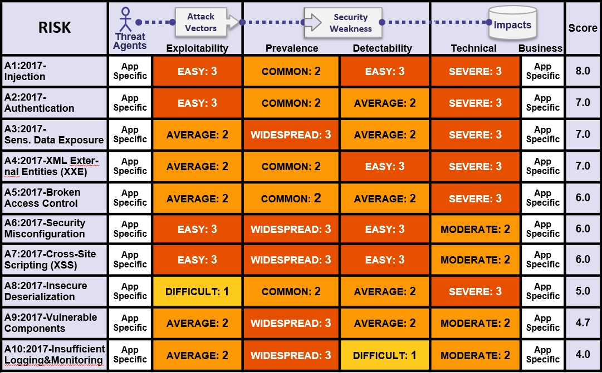

# +RF Thông tin chi tiết về các yếu tố nguy cơ

## Top 10 nhân tố rủi ro Tóm tắt

Bảng dưới đây trình bày tóm tắt 2017 Top 10 Rủi ro An ninh Ứng dụng, và các yếu tố rủi ro mà chúng tôi đã gán cho mỗi rủi ro. Những yếu tố này đã được xác định dựa trên số liệu thống kê hiện có và kinh nghiệm của nhóm OWASP Top 10. Để hiểu những rủi ro này đối với một ứng dụng hoặc tổ chức cụ thể, bạn phải xem xét các tác nhân kinh doanh và tác nhân kinh doanh của mình. Ngay cả những điểm yếu phần mềm nghiêm trọng cũng không có nguy cơ nghiêm trọng nếu không có các tác nhân đe doạ có khả năng thực hiện cuộc tấn công cần thiết hoặc tác động kinh doanh không đáng kể đối với các tài sản có liên quan.

## Rủi ro bổ sung cần xem xét

Top 10 bao gồm rất nhiều mặt đất, nhưng có nhiều rủi ro khác mà bạn nên xem xét và đánh giá trong tổ chức của bạn. Một số trong số này đã xuất hiện trong các phiên bản trước của Top 10, và một số khác đã không, bao gồm các kỹ thuật tấn công mới đang được xác định tất cả thời gian. Các nguy cơ bảo mật ứng dụng quan trọng khác (theo lệnh của CWE-ID) mà bạn nên xem xét thêm:

* [CWE-352: Cross-Site Request Forgery (CSRF)](https://cwe.mitre.org/data/definitions/352.html)
* [CWE-400: Uncontrolled Resource Consumption ('Resource Exhaustion', 'AppDoS')](https://cwe.mitre.org/data/definitions/400.html)
* [CWE-434: Unrestricted Upload of File with Dangerous Type](https://cwe.mitre.org/data/definitions/434.html)
* [CWE-451: User Interface (UI) Misrepresentation of Critical Information (Clickjacking and others)](https://cwe.mitre.org/data/definitions/451.html)
* [CWE-601: Unvalidated Forward and Redirects](https://cwe.mitre.org/data/definitions/601.html)
* [CWE-799: Improper Control of Interaction Frequency (Anti-Automation)](https://cwe.mitre.org/data/definitions/799.html)
* [CWE-829: Inclusion of Functionality from Untrusted Control Sphere (3rd Party Content)](https://cwe.mitre.org/data/definitions/829.html)
* [CWE-918: Server-Side Request Forgery (SSRF)](https://cwe.mitre.org/data/definitions/918.html)

